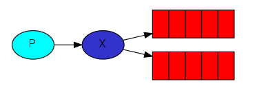
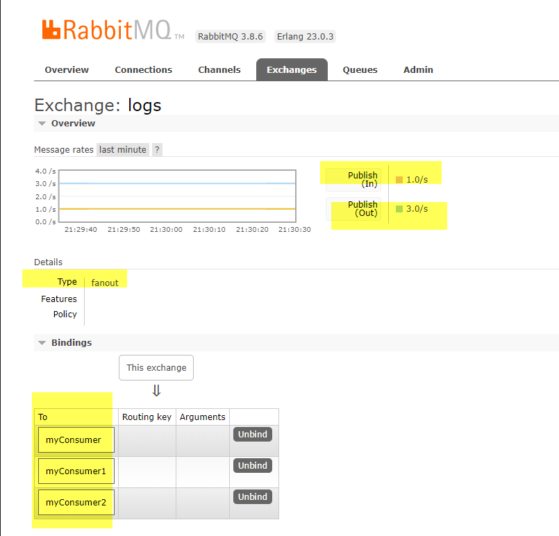

### Publish/Subscribe

We'll deliver a message to multiple consumers. This pattern is known as "publish/subscribe".

In previous parts of the tutorial we sent and received messages to and from a queue. we knew nothing about exchanges, but still were able to send messages to queues. That was possible because we were using a default exchange, which is identified by the empty string ("").

However, the messaging model in RabbitMQ is that the producer never sends any messages directly to a queue. Actually, quite often the producer doesn't even know if a message will be delivered to any queue at all.

Instead, the producer can only send messages to an **exchange**. 

On one side it receives messages from producers and the other side it pushes them to queues. 



The exchange must know exactly what to do with a message it receives. Should it be appended to a particular queue? Should it be appended to many queues? Or should it get discarded. The rules for that are defined by the **exchange type**. `direct`, `topic`, `headers` and `fanout`

In this example we use `fanout` exchange type, it just broadcasts all the messages it receives to all the queues it knows. 

src/exchange.js

```js
const chalk = require('chalk');

// exchange
const publishViaExchange = async (connection, message) => {
  const exchangeName = 'logs';
  if (!connection) throw new Error('connection not found')
  try {
    const channel = await connection.createChannel()
    // assertExchange(exchange, type, [options])
    // this will create a exchange of tyoe `fanout`
    await channel.assertExchange(exchangeName, 'fanout', {
      durable: false
    });
    console.log('publishing params', chalk.green(message))
    // The messages will be lost if no queue is bound to the exchange yet, but that's okay for us; 
    // if no consumer is listening yet we can safely discard the message.

    // #publish(exchange, routingKey, content, [options])
    const result = await channel.publish(exchangeName, '', Buffer.from(message))
    console.log(' [x] Sent %s', chalk.green(result))
    return result
  } catch (error) {
    console.warn(chalk.red(error))
  }
}


module.exports = publishViaExchange
```

And to simulate logs generated:

src/emit_log.js
```js
const getConnection = require('./connection');
const publishViaExchange = require('./exchange');

const init = async () => {
  const conn = await getConnection()
  let counter = 0
  // allow some time for message to be saved into queue
  setInterval(async () => {
    counter += 1
    await publishViaExchange(conn, `Counter number is ${counter}`)
  }, 1000)
}

init()
```

Then we need to consume the message sent via exchange. Because the type of exchange is `fanout`, therefore you can have multiple(as many as you want) consumers. Each of them will receive the same message, as long as they are  different queues.

```js
const chalk = require('chalk');
const wait = require('./utils/wait')

// Consumer
const consumeViaTempQueue = async (connection) => {
  if (!connection) throw new Error('connection not found')
  const exchangeName = 'logs';
  try {
    const channel = await connection.createChannel()
    await channel.assertExchange(exchangeName, 'fanout', {
      durable: false
    });
    // use nameless queue, rabbitmq will generate a random queue name for you
    const q = await channel.assertQueue('', { exclusive: true })
    console.log('q', chalk.yellow(JSON.stringify(q)))
    // Now we need to tell the exchange to send messages to our queue. 
    // That relationship between exchange and a queue is called a binding.
    await channel.bindQueue(q.queue, exchangeName, '');

    // wait one second to see message appended into the queue
    await wait(1000);

    const message = await channel.get(q.queue)
    /**
     * 
     *  {"fields":{"deliveryTag":1,"redelivered":false,"exchange":"logs","routingKey":"","messageCount":0},"properties":{"headers":{}},"content":{"type":"Buffer","data":[somme binary]}}
     * 
     */
    console.log('message', chalk.yellow(JSON.stringify(message)))
    if (message) {
      channel.ack(message)
      return message.content.toString()
    }
  } catch (error) {
    console.warn(chalk.red(error))
  }
}

module.exports = consumeViaTempQueue
```

Note:

1. `const q = await channel.assertQueue('', { exclusive: true })` there we used a empty queue name, rabbitmq will generate a random queue name for you, For example it may look like `amq.gen-JzTY20BRgKO-HjmUJj0wLg`. but once we disconnect the consumer the queue should be automatically deleted.

2. In your consumer, we need to tell the exchange to send messages to our queue. That relationship between exchange and a queue is called a binding. `await channel.bindQueue(q.queue, exchangeName, '')`

3. you can run you node.js from command line, like `./src/receive_logs.js > logs_from_rabbit.log`, this will save all the console.log message into file, given:
1) receive_logs.js file has chomd +x
2) put `#!/usr/bin/env node` at the top of receive_logs.js file

receive_logs.js 
```js
#!/usr/bin/env node

const getConnection = require('./connection');
const consumeViaTempQueue = require('./tempraryQueue')
const chalk = require('chalk');

const init = async () => {
  const conn = await getConnection()
  setInterval(async () => {
    const msg = await consumeViaTempQueue(conn)
    console.log('msg', chalk.green(msg))
  }, 1000);
}

init()
```

4. Let's say you have 1 publisher, and 3 different consumers, they bind to `myConsumer`, `myConsumer1`, `myConsumer2` queue, then all of them will receive message, becasue the exchange type is `fanout`


