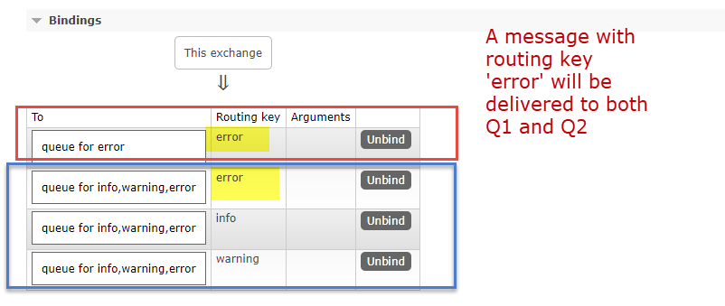
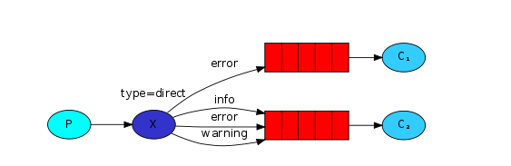

.src/exchange_routing.js
```js
const chalk = require('chalk');
const randomSeverity = require('./utils/randomSeverity')

// exchange
const publishViaExchangeWithRouting = async (connection, message) => {
  const exchangeName = 'direct_logs';
  // generate random routing key.`info`, `error`, `debug` or `warning`
  const severity = randomSeverity();
  if (!connection) throw new Error('connection not found')
  try {
    const channel = await connection.createChannel()
    // assertExchange(exchange, type, [options])
    // this will create a exchange of tyoe `direct`
    await channel.assertExchange(exchangeName, 'direct', {
      durable: false
    });
    console.log('publishing params', chalk.green(message), chalk.yellow(severity))


    // #publish(exchange, routingKey, content, [options])
    // use severity 'error', 'info', 'warning' or 'debug' as routing key
    const result = await channel.publish(exchangeName, severity, Buffer.from(message))
    console.log(' [x] Sent %s', chalk.green(result)) // result will be true/false
    return result
  } catch (error) {
    console.warn(chalk.red(error))
  }
}


module.exports = publishViaExchangeWithRouting
```

Main difference between exchange `fanout` and `direct` is that, `fanout` exchange does NOT need a `routing key`, because it's only capable of mindless broadcasting. Whereas for `direct` exchange, you will need to include a routing key when publishing a message, then this message goes to the queues whose binding key exactly matches the routing key of the message.


```js
  // a queue can bind to multiple routing keys.
    for (routingKey of routingKeys) await channel.bindQueue(q.queue, exchangeName, routingKey);
```

Firstly for sending out message, we use below code to send out messages with random routing key, it can be 'error', 'info', 'warning' or 'debug'.

./src/emit_logs_direct.js
```js
#!/usr/bin/env node

const getConnection = require('./connection');
const publishViaExchangeWithRouting = require('./exchange_routing');

const init = async () => {
  const conn = await getConnection()
  let counter = 0
  // allow some time for message to be saved into queue
  setInterval(async () => {
    counter += 1
    await publishViaExchangeWithRouting(conn, `Counter number is ${counter}`)
  }, 1000)
}

init()
```

./src/publishViaExchangeWithRouting.js
```js
const chalk = require('chalk');
const randomSeverity = require('./utils/randomSeverity')

// exchange
const publishViaExchangeWithRouting = async (connection, message) => {
  const exchangeName = 'direct_logs';
  // generate random routing key.`info`, `error`, `debug` or `warning`
  const severity = randomSeverity();
  if (!connection) throw new Error('connection not found')
  try {
    const channel = await connection.createChannel()
    // assertExchange(exchange, type, [options])
    // this will create a exchange of tyoe `direct`
    await channel.assertExchange(exchangeName, 'direct', {
      durable: false
    });
    console.log('publishing params', chalk.green(message), chalk.yellow(severity))


    // #publish(exchange, routingKey, content, [options])
    // use severity 'error', 'info', 'warning' or 'debug' as routing key
    const result = await channel.publish(exchangeName, severity, Buffer.from(message))
    console.log(' [x] Sent %s', chalk.green(result)) // result will be true/false
    return result
  } catch (error) {
    console.warn(chalk.red(error))
  }
}


module.exports = publishViaExchangeWithRouting
```

Multiple bindings

A binding is a relationship between an exchange and a queue. This can be simply read as: the queue is interested in messages from this exchange.

It is perfectly legal to bind multiple queues with the same binding key. 

In our example, we can see the direct exchange `direct_logs` with **two queues** bound to it. The first queue is bound with binding key `error`, and the second has 3 bindings, one with binding key `info`, one with binding key `error` and the other one with `warning`.





For `direct` exchane, binding can take, `queueName`, `exchangeName` and `routingKey`

```
await channel.bindQueue(q.queue, exchangeName, routingKey);
```

.src/queueWithRoutingKey.js
```js
const chalk = require('chalk');
// const { v4: uuidv4 } = require('uuid');
const wait = require('./utils/wait')

// Consumer
const consumeViaQueueWithRoutingKey = async (connection, routingKeys) => {
  if (!connection) throw new Error('connection not found')
  const exchangeName = 'direct_logs';
  try {
    const channel = await connection.createChannel()
    await channel.assertExchange(exchangeName, 'direct', {
      durable: false
    });
    // use named queue
    const q = await channel.assertQueue(`queue for ${routingKeys.join(',')}`, { exclusive: true })
    console.log('q', chalk.yellow(JSON.stringify(q)))

    // a queue can bind to multiple routing keys.
    for (routingKey of routingKeys) await channel.bindQueue(q.queue, exchangeName, routingKey);

    // wait one second to see message appended into the queue
    await wait(1000);

    const message = await channel.get(q.queue)
    /**
     * 
     *  {"fields":{"deliveryTag":1,"redelivered":false,"exchange":"logs","routingKey":"","messageCount":0},"properties":{"headers":{}},"content":{"type":"Buffer","data":[somme binary]}}
     * 
     */
    console.log('message', chalk.yellow(JSON.stringify(message)))
    if (message) {
      channel.ack(message)
      return message.content.toString()
    }
  } catch (error) {
    console.warn(chalk.red(error))
  }
}

module.exports = consumeViaQueueWithRoutingKey
```

.src/receive_logs_direct.js

```js
#!/usr/bin/env node

const getConnection = require('./connection');
const consumeViaQueueWithRoutingKey = require('./queueWithRoutingKey')
const chalk = require('chalk');

const routingKey = process.argv[2]

const init = async () => {
  const conn = await getConnection()
  setInterval(async () => {
    const msg = await consumeViaQueueWithRoutingKey(conn, routingKey)
    console.log('msg', chalk.green(msg))
  }, 1000);
}

init()
```

To run it, ` ./src/receive_logs_direct.js <routingKeys>` 
for example:
`./src/receive_logs_direct.js info warning error` will accept all messages with routing key `info`, `warning` or `error`

`./src/receive_logs_direct.js error` will accept messages with routing key `error` ONLY.
