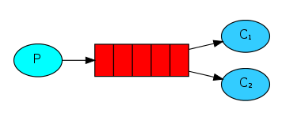

### Work Queues

Work Queues will be used to distribute time-consuming tasks among multiple workers.



#### Message durability

1. `channel.assertQueue('hello', {durable: true});` to make the queue to **survive** a RabbitMQ node **restart**
2. `channel.sendToQueue(queue, Buffer.from(msg), {persistent: true});` to mark our messages as **persistent** after a  RabbitMQ node **restart**

#### Message acknowledgment

```js
if (message) {
  channel.ack(message)
}
```
It's a common mistake to miss the ack. It's an easy error, but the consequences are serious. Messages will be redelivered when your client quits (which may look like random redelivery), but RabbitMQ will eat more and more memory as it won't be able to release any unacked messages.


#### Fair dispatch vs Round-robin dispatching

By default, RabbitMQ will send each message to the next consumer, in sequence. On average every consumer will get the same number of messages. This way of distributing messages is called `round-robin`.

However, it doesn't look at the number of unacknowledged messages for a consumer. It just blindly dispatches every n-th message to the n-th consumer.

In order to defeat that we can use the **prefetch** method with the value of 1. This tells RabbitMQ not to give more than one message to a worker at a time. Or, in other words, don't dispatch a new message to a worker until it has processed and acknowledged the previous one. Instead, it will dispatch it to the next worker that is not still busy.